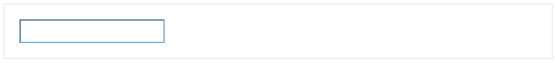
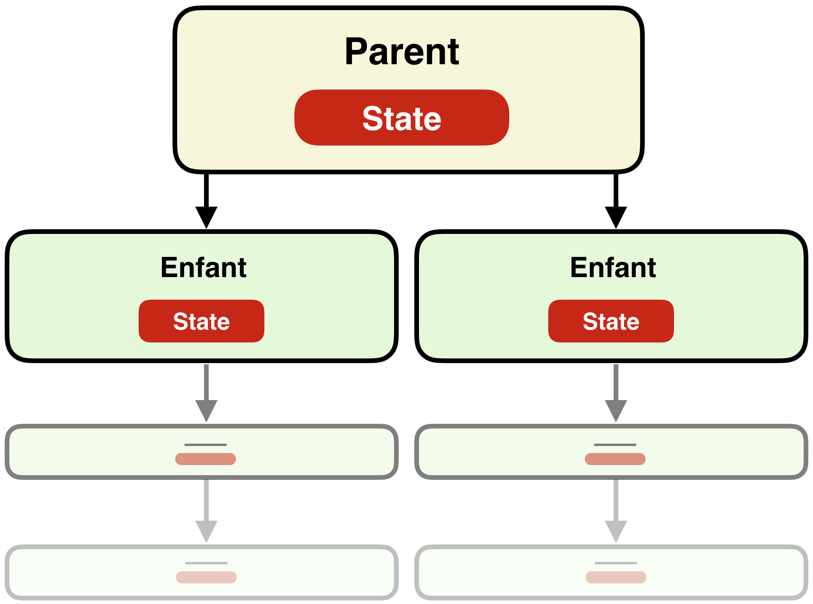
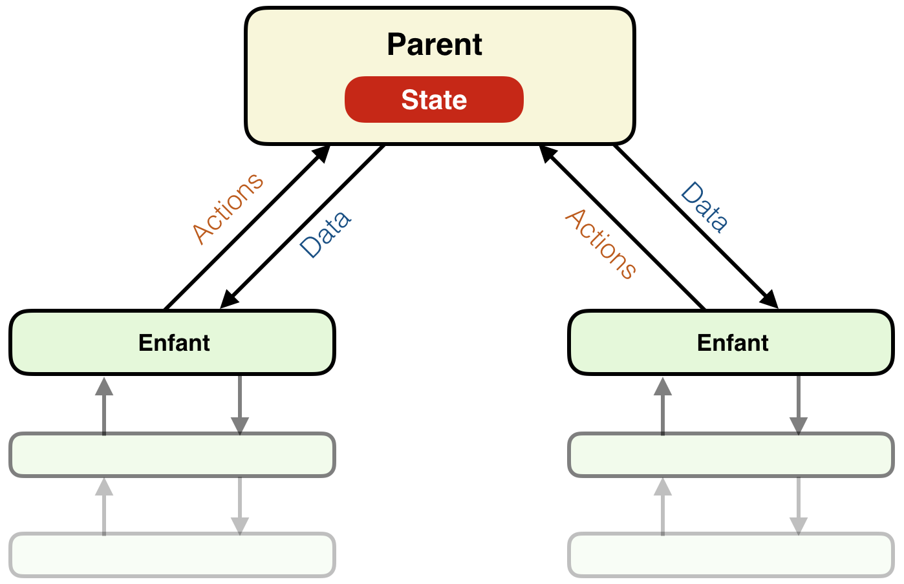

class: middle, center, title

<h1><strong>Développement d’applications JavaScript</strong><br>Passé, présent et futur 🚀</h1>

<div class="talk-meta">
  Web à Québec 2017/04 — @remi
</div>

---

layout: true

---

class: middle, title2

# 🤗 Moi…

* **Rémi Prévost** 
* Développeur Web chez Mirego 
* Bâti des applications Web depuis 2007
* Toujours à la recherche de la solution parfaite™

---

class: middle, title4

# 🤔 Pourquoi?

* Évolution des outils chez Mirego
* Pourquoi ces outils existent ou ont existé?
* Combattre la _JavaScript fatigue_… 😡

---

# 📈 Différents patterns

<table class="lol" cellspacing="10" cellpadding="10">
  <tr>
    <td width="25%"><span class="emoji">🎙</span> Zero binding</td>
    <td width="25%"><span class="emoji">🔗</span> Two-way binding</td>
    <td width="25%"><span class="emoji">🎢</span> One-way binding</td>
    <td width="25%"><span class="emoji">🏪</span> Store binding</td>
  </tr>
</table>

---

# 🎙 Zero binding
> Beaucoup de code, pas de magie

* Code HTML généré par le serveur
* Appliquer un comportement à un ensemble d’éléments HTML
* Components

---

# 🎙 Zero binding

## Initialisation

<code class="filename">application.js</code>
```js
import RemoteForm from 'components/remote-form';

$(document).ready(function() {
  $('.remote-form').each(function(_index, element) {
    var $element = $(element);
    new RemoteForm($element);
  });
});
```

---

# 🎙 Zero binding

## Exemple de component

<code class="filename">components/remote-form.js</code>
<div class="watch-out-for-long-code-block"></div>
```js
class RemoteForm {
  constructor($element) {
    this.$element = $element;
    this.bindEvents();
  }

  bindEvents() {
    this.$element.on('submit', function(event) { this.handleFormSubmit(event) });
  }

  handleFormSubmit(event) {
    event.preventDefault();

    $.post(this.$element.attr('action'), {
      data: {…},
      success: function() { this.handleFormSubmissionSuccess() }
    });
  }

  handleFormSubmissionSuccess() {
    this.$element.addClass('submitted');
    this.$element.find('.remote-form__success-message').show();
  }
}
```

---

# 🎙 Zero binding

## Évènements globaux

<code class="filename">application.js</code>
```js
window.$App = $(window);
```

<code class="filename">component.js</code>
```js
class Component {
  broadcast(event) {
    const args = Array.prototype.slice.call(arguments, 1);
    window.$App.trigger.apply(window.$App, [event, args]);
  }

  subscribe(event, callback) {
    window.$App.on(event, callback);
  }

  unsubscribe(event, callback) {
    window.$app.off(event, callback);
  }
}
```

---

# 🎙 Zero binding

<code class="filename">components/loading-indicator.js</code>
<div class="watch-out-for-long-code-block"></div>
```js
class LoadingIndicator extends Component {
  constructor($element) {
    super($element);

    this.subscribe('showLoadingIndicator', function() { this.handleShowLoading() });
    this.subscribe('hideLoadingIndicator', function() { this.handleHideLoading() });
  }

  handleShowLoading() { this.$element.show(); }
  handleHideLoading() { this.$element.hide(); }
}
```

<code class="filename">components/remote-form.js</code>
<div class="watch-out-for-long-code-block"></div>
```js
class RemoteForm extends Component {
  handleFormSubmit() {
    this.broadcast('showLoadingIndicator');

    // …
  }

  handleFormSubmissionSuccess() {
    this.broadcast('hideLoadingIndicator');

    // …
  }
}
```

---

# 🎙 Zero binding
> Beaucoup de code, pas de magie

## Avantages

* Encapsulation de la logique
* Nous force à bien séparer nos comportements

## Problèmes

* Gestion manuelle du DOM
* Gestion manuelle (et complexe) du state global d’application

---

# 🔗 Two-way binding
> Moins de code, trop de magie

* State is hard — _make it just work™_
* Popularisé par Angular, Ember.js, etc.
* Single Page Applications (SPA)
  * Plus besoin de gérer le DOM nous-mêmes! 🎉

---

# 🔗 Two-way binding

Le _Hello World_ du two-way binding :

<code class="filename">hello-world.html</code>
```html
<div>
  <input ng-model="firstName" type="text" />
  <strong>{{firstName}}</strong>
</div>
```

## Live!



---

# 🔗 Two-way binding

<code class="filename">directives/toggleable-message/controller.js</code>
```js
const ToggleableMessageController = ($scope) => {(
  handleButtonClick() {
    $scope.showMessage = !$scope.showMessage;
  }
)};
```

<code class="filename">directives/toggleable-message/template.html</code>
```html
<button ng-click="controller.handleButtonClick()">
  toggle
</button>

<div ng-if="showMessage">
  Ce message s’affiche et se cache au clic du bouton
</div>
```

---

# 🔗 Two-way binding



---

# 🔗 Two-way binding

<code class="filename">components/parent/controller.js</code>
```js
const ParentController = ($scope) => {
  $scope.message = { title: 'Hello world' };
};
```

<code class="filename">components/parent/template.html</code>
```html
<div>
  Message: {{message.title}}
  <enfant message="message"></enfant>
</div>
```

<code class="filename">components/enfant/controller.js</code>
```js
const EnfantController = ($scope) => {(
  handleButtonClick() {
    $scope.message.title = $scope.message.title.toUpperCase();
  }
)};
```

<code class="filename">components/enfant/template.html</code>
```html
<button ng-click="controller.handleButtonClick()">Do it!</button>
```

---

# 🔗 Two-way binding
> Moins de code, trop de magie

## Avantages

* Gestion automatique du DOM
* State global en passant des données vers le bas

## Problèmes

* Gestion du state invisible…
  * Problèmes de performance?
* Difficulté à déboguer
  * Situations inexpliquées

---

# 🎢 One-way binding
> Moins de magie, plus de code

* State is hard — _let’s make it visible™_
* Popularisé par React
* _Data Down Actions Up_

---

# 🎢 One-way binding



---

# 🎢 One-way binding

<code class="filename">parent.js</code>
```js
class Parent extends React.Component {
  state = {
    message: {title: 'Hello world'}
  };

  handleMessageUpdate(newMessage) {
    this.setState({message: newMessage});
  }

  render() {
    return <div>
      <p>Message: {this.state.message.title}</p>
      <Enfant
        message={this.state.message}
        onMessageUpdate={this.handleMessageUpdate.bind(this)}
      />
    </div>;
  }
}
```

---

# 🎢 One-way binding

<code class="filename">enfant.js</code>
```js
class Enfant extends React.Component {
  handleButtonClick() {
    const message = this.props.message;
    const newTitle = message.title.toUpperCase();
    const newMessage = {...message, title: newTitle};

    this.props.onMessageUpdate(newMessage);
  }

  render() {
    return <div>
      <button onClick={this.handleButtonClick.bind(this)}>Do it!</button>
    </div>;
  }
}
```

---

# 🎢 One-way binding

<code class="filename">header.js</code>
```js
class Header extends React.Component {
  render() {
    return <div>
      <UserBlock onLogoutClick={this.props.onLogoutClick.bind(this)} />
    </div>;
  }
}
```

<code class="filename">user-block.js</code>
```js
class UserBlock extends React.Component {
  render() {
    return <div>
      <UserDropdown onLogoutClick={this.props.onLogoutClick.bind(this)} />
    </div>;
  }
}
```

😴

---

# 🎢 One-way binding
> Moins de magie, plus de code

## Avantages

* Explicite
* Facilement déboguable

## Problèmes

* Beaucoup de code à écrire
* Complexité à maintenir et à structurer

---

# 🏪 Store binding
> <u>Moins</u> de magie, <u>moins</u> de code

Dans le fond, on veut :

* Explicite et déboguable
* Sans lourdeur de code
* **Holy Grail 🏆**

---

class: middle, center, title3

# Redux

<div class="quote">
  “<em>Redux is a predictable state container for JavaScript apps.</em>”
</div>

---

class: middle, center, title5

<table class="lol2">
  <tr>
    <td width="33%"><span>🏪<br> Store</span></td>
    <td width="33%"><span>⚡️<br> Actions</span></td>
    <td width="33%"><span>⚗️ <br> Reducer</span></td>
  </tr>
</table>

---

# 🏪 Store binding

## Redux / Reducer

<code class="filename">reducer.js</code>
```js
function reducer(state = {clickCount: 0}, action) {
  switch (action.type) {
    case 'INCREASE_CLICK_COUNT':
      const newCount = state.clickCount + 1;
      return {...state, clickCount: newCount};

    case 'DECREASE_CLICK_COUNT':
      const newCount = state.clickCount - 1;
      return {...state, clickCount: newCount};

    default:
      return {...state};
  }
}

export default reducer;
```

---

# 🏪 Store binding

## Redux / Store

```js
import {createStore} from 'redux';
import reducer from './reducer';

const store = createStore(reducer);
store.subscribe(() => console.log('store state', store.getState()));

console.log('initial store state', store.getState());
// => initial store state, { clickCount: 0 }

store.dispatch({type: 'INCREASE_CLICK_COUNT'});
// => store state, { clickCount: 1 }

store.dispatch({type: 'INCREASE_CLICK_COUNT'});
// => store state, { clickCount: 2 }

store.dispatch({type: 'DECREASE_CLICK_COUNT'});
// => store state, { clickCount: 1 }
```

---

# 🏪 Store binding

## Redux

<div class="watch-out-for-long-code-block"></div>
```js
import {createStore} from 'redux';

function reducer(state = {clickCount: 0}, action) {
  switch (action.type) {
    case 'INCREASE_CLICK_COUNT':
      const newCount = state.clickCount + 1;
      return {...state, clickCount: newCount};

    case 'DECREASE_CLICK_COUNT':
      const newCount = state.clickCount - 1;
      return {...state, clickCount: newCount};

    default:
      return {...state};
  }
}

const store = createStore(reducer);

store.subscribe(() => console.log('store state', store.getState()));

store.dispatch({type: 'INCREASE_CLICK_COUNT'});
// => store state, { clickCount: 1 }

store.dispatch({type: 'DECREASE_CLICK_COUNT'});
// => store state, { clickCount: 0 }
```

---

# 🏪 Store binding

## Redux + React

1. **injecter des propriétés** aux components à partir du state du store
2. **dispatcher des actions** à partir de nos components

---

# 🏪 Store binding

## Redux + React

<code class="filename">parent.js</code>
<div class="watch-out-for-long-code-block"></div>
```js
class Parent extends React.Component {
  render() {
    return <div>
      <Enfant />
    </div>;
  }
}
```

<code class="filename">enfant.js</code>
<div class="watch-out-for-long-code-block"></div>
```js
class Enfant extends React.Component {
  handleButtonClick() {
    const message = this.props.message;
    const newMessage = {...message, title: message.title.toUppercase()};
    this.props.dispatch({type: 'UPDATE_MESSAGE', message: newMessage});
  }

  render() {
    return <div>
      <p>Message: {this.props.message.title}</p>
      <button onClick={this.handleButtonClick.bind(this)}>Do it!</button>
    </div>;
  }
}
```

---

# 🏪 Store binding

## Redux + React

<code class="filename">reducer.js</code>
```js
const INITIAL_STATE = {
  message: {title: 'Hello world'}
};

export default function reducer(state = INITIAL_STATE, action) {
  switch (action.type) {
    case 'UPDATE_MESSAGE':
      const newMessage = action.messaage;
      return {...state, message: newMessage};

    default:
      return state;
  }
};
```

---

# 🏪 Store binding

## Redux + React

<code class="filename">parent.js</code>
```js
import {createStore} from 'redux';
import {Provider} from 'react-redux';
import reducer from 'reducer';

class Parent extends React.Component {
  render() {
    return <div>
      <Enfant />
    </div>;
  }
}

Parent = <Provider store={createStore(reducer)}>
  <Parent />
</Provider>;
```

---

# 🏪 Store binding

## Redux + React

<code class="filename">enfant.js</code>
```js
import {connect} from 'react-redux';

class Enfant extends React.Component {
  handleButtonClick() {
    const message = this.props.message;
    const newMessage = {...message, title: message.title.toUppercase()};
    this.props.dispatch({type: 'UPDATE_MESSAGE', message: newMessage});
  }

  render() {
    return <div>
      <p>Message: {this.props.message.title}</p>
      <button onClick={this.handleButtonClick.bind(this)}>Do it!</button>
    </div>;
  }
}

const mapStateToProps = (state) => ({message: state.message});
Enfant = connect(mapStateToProps)(Enfant);
```

---

# 🏪 Store binding
> Moins de magie, moins de code

## Avantages

* Explicite et déboguable (outils de développements!)
* Léger
* Testable (fonctions pures!)

## Problèmes

* Nécessite du _thinking_ pour structurer et dénormaliser le state global

---

class: middle, center, title

<h1><strong>C’est tout!</strong></h1>

<div class="talk-meta">
  Questions? Commentaires?
  <div class="talk-meta-emoji">
    🎙  🔗  🎢  🏪
    <br>🤓 🤠 🙄 😗
  </div>
</div>
